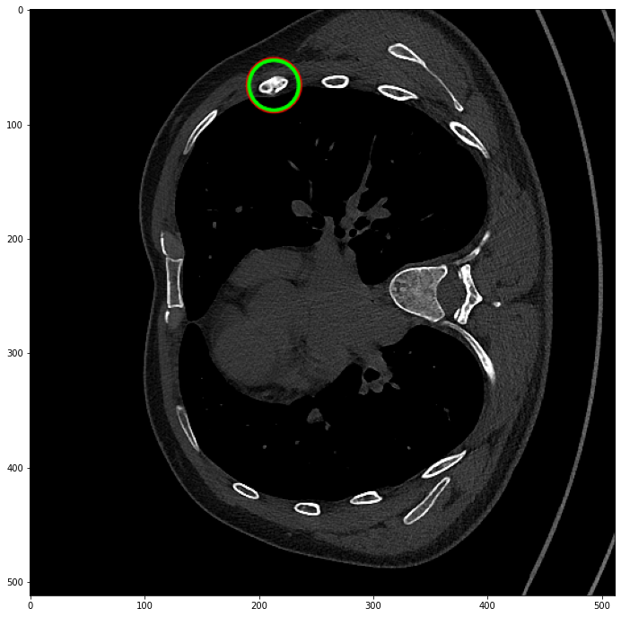

# A deep learning model for rib fracture detection

|                                                                             |
| :-----------------------------------------------------------------------------------------------------------------------------------: |
| <b>Figure 1: </b> A) An axial slice from a chest CT scan from the validation set. B) The model prediction. C) The ground-truth label. |

# Intro

This project is a proof-of-concept [UNet](https://arxiv.org/abs/1505.04597) model for detecting and classifying rib fractures in chest CT scans. It is trained on the [RibFrac Grand Challenge](https://ribfrac.grand-challenge.org/) dataset. The model's input is a 512x512 axial slice and it predicts one of five possible classes for each pixel. The label class codes are described in the table below. See the figure above for an example input slice, label, and prediction.

| Label code | Description                        |
| ---------- | ---------------------------------- |
| -1         | fracture of unknown type (ignored) |
| 0          | background                         |
| 1          | displaced fracture                 |
| 2          | non-displaced fracture             |
| 3          | buckle fracture                    |
| 4          | segmental fracture                 |

# Loss function

The model loss function is a weighted sum of three terms:

1. the cross-entropy loss (CE)
2. binary-DICE (BD) loss
3. multi-DICE (MD) loss

where binary-DICE is the [DICE](https://en.wikipedia.org/wiki/S%C3%B8rensen%E2%80%93Dice_coefficient) score for binary, fracture vs. non-fracture, classification, and multi-DICE is a simple average of the DICE scores for each non-background class. That is,

$$
L(y, \hat{y}) = w_{ce}\mathit{CE} - w_{bd}\log\mathit{BD} - w_{md}\log\mathit{MD}
$$

where $y$ is the label and $\hat{y}$ is the prediction.

The weights are hyperparameters which can be tuned by editing the `src/unet/hparams.py` file.

# Setup

## Install Miniconda

If you don't already have `conda`, please find the install instructions [here](https://docs.conda.io/projects/conda/en/latest/user-guide/install/index.html#regular-installation).

## Create the conda environment

```bash
conda env create -f env.yml
```

## Get the Data

Download the RibFrac challenge training and validation data, then extract and move the files to
a folder named `data/ribfrac-challenge`. Please combine the `Part1/` and `Part2/` images and labels folders
into one folder. Also concatenate the two training info `.csv` files into one file.

The final folder structure should look like this:

```
data/
  ribfrac-challenge/
    training/
      ribfrac-train-info-all.csv
      images/
        RibFrac1-image.nii.gz
        ...
        RibFrac420-image.nii.gz
      labels/
        RibFrac1-label.nii.gz
        ...
    validation/
      ribfrac-val-info.csv
      ribfrac-val-images/
          RibFrac421-image.nii.gz
          ...
      ribfrac-val-labels/
          RibFrac421-label.nii.gz
          ...
```

## Prepare the Data

The next step is to run the data preparation script:

```bash
python -m src.prepare_data --split all
```

This will prepare and save each 2d slice of every scan. The script takes about 1 hour on our desktop workstation.

Once that's done, compute the class counts over the training set. These are used for class re-weighting during training.

```bash
python -m src.get_class_counts
```

## Training

```bash
python -m src.train --wandb-api-key [optional]
```

You can adjust hyperparameters in the file `src/unet/hparams.py`.

## Inference

```bash
python -m src.infer --in-dir <scans-dir> --out-dir <predictions-dir> --checkpoint <checkpoint-path>
```

## Preliminary Results

So far, we have achieved an ~88% binary DICE on the validation set after 5 training epochs. The binary DICE score highly depends on the value of the `bd_weight` hyperparameter (fracture vs non-fracture), and setting it too high interferes with classifying pixels into sub-types.

To get predictions at the fracture level instead of just the pixel level, we apply blob detection on the raw probabilities and results look as below. See the `data_exploration/eval.ipynb` for more details.


