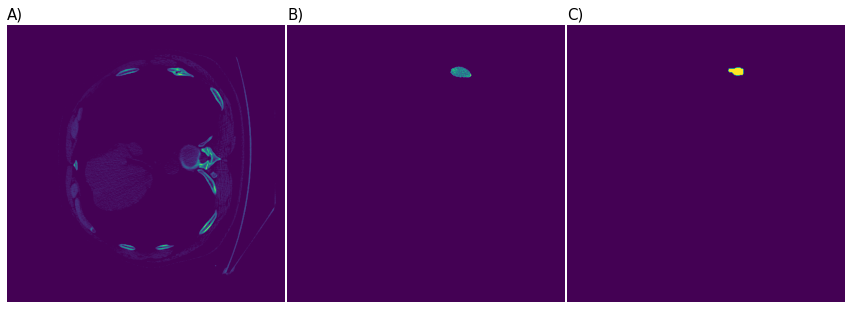

# ribfrac

|                                                                             |
| :-----------------------------------------------------------------------------------------------------------------------------------: |
| <b>Figure 1: </b> A) An axial slice from a chest CT scan from the validation set. B) The model prediction. C) The ground-truth label. |

# Intro

This repo contains a [UNet](https://arxiv.org/abs/1505.04597) model for detecting and classifying rib fractures in chest CT scans. It is trained on the [RibFrac Grand Challenge](https://ribfrac.grand-challenge.org/) dataset. The model's input is a batch of 512x512 axial slices. See figure 1 for an example.

## Setup

## Install Miniconda

If you don't already have `conda`, please find the install instructions [here](https://docs.conda.io/projects/conda/en/latest/user-guide/install/index.html#regular-installation).

## Create the conda environment

```bash
conda env create -f env.yml
```

## Download the data

Download the RibFrac challenge training and validation data, then extract and move the files to
a folder named `data/ribfrac-challenge` in the root of this repo. You will need to combine
the `Part1/` and `Part2/` images and labels into single folders named `all/`, and combine the two train info `csv` files
into a single file named `ribfrac-train-info-all.csv`.

The final folder structure should look as follows.

```
data/
  ribfrac-challenge/
    training/
      ribfrac-train-info-all.csv
      images/
        RibFrac1-image.nii.gz
        ...
        RibFrac420-image.nii.gz
      labels/
        RibFrac1-label.nii.gz
        ...
    validation/
      ribfrac-val-info.csv
      ribfrac-val-images/
          RibFrac421-image.nii.gz
          ...
      ribfrac-val-labels/
          RibFrac421-label.nii.gz
          ...
```

## Prepare Data

The next step after downloading the RFC data is to run the data preparation script:

```bash
python -m src.prepare_data --split all
```

This will prepare and save each 2d slice of every image. The script takes about 1 hour on our desktop workstation.

Next, compute the class counts over the training set. These are used for class re-weighting during training.

```bash
python -m src.get_class_counts
```

## Train

```bash
python -m src.train
```

## Inference

```bash
python -m src.infer --in-dir <scans-dir> --out-dir <predictions-dir> --checkpoint <checkpoint-path>
```
